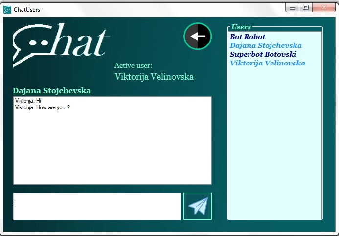
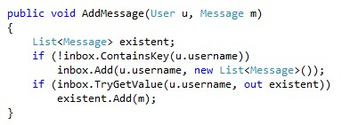

# Chat
Chat Application - Visual Programming Project
by : 
Viktorija Velinovska ,
Dajana Stojchevska 

#1.Опис на апликацијата

Апликацијата која што  ја изработивме  претставува Chat –апликација.
Апликацијата им дозволува на корисниците да ја користат само доколку предходно имаат креирано `account`. Откако корисникот ќе се најави со своето корисничко име и лозинка му се прикажува неговиот профил кој ги содржи информациите внесени при неговата регистрација. На оваа форма покрај инфомациите има и неколку копчиња кои служат за навигација низ другите форми. На корисникот му се нуди можност да ја види  својата листа на пријатели, да се одјави, да одбере игра или пак да направи    `edit` на својот профил.  Доколку одбере опција “friends” тогаш му се отвара форма за chat-ување. На оваа форма всушност може да ги види сите корисници кои што се најавиле на апликацијата и да испрати порака на некој од нив.  Доколку одбере “play game”  му се отвара мала игра , која може да ја игра неограничен број пати. За излез од апликацијата  потребно е доколку се наоѓа на форма која што не е неговиот профил да се врати на профилната форма и да кликне на копче „Одјави се “ кое ќе го доведе до првичната форма за најава на апликацијата. На било која друга форма копчето  Close e оневозможено.
#2. Упатство за користење на апликацијата
###2.1  Sign In Form
Со стартување на апликацијата на корисникот му се отвара почетната форма.

Од тука може да се најави доколку веќе има креирано `account` или пак да се регистрира и да си креира нов `account`,
###2.2  Register form
Ако се работи за нов корисник кој предходно не се најaвил на системот тоа може да го направи со кликнување на `Register` копчето.
\- Потоа се прикажува формата за креирање нов  кориснички профил , во која корисникот може да ги внесе своите податоци. Сите полиња се задолжителни освен профилната слика. Доколку корисникот сака да постави своја слика тоа може да го направи со клик на “choose” копчето , во спротивно ќе му се генрира рандом слика од страна на апликацијата. Формата за потполнување изгледа вака:

Со кликнување на копчето “cancel”  се прекинува креирањето на корисничкиот профил и повторно се отвара почетната форма.Со клик на “Submit” се креира профил на корисникот и се генерира нова форма со внесените податоци.
###2.3  Profile form
Ако корисникот предходно имал креирано корисничkи профил или штотуку го креирал му се отвара следната форма: 

Тука се прикажани податоците за корисникот, сликата што прикачил, како и 2 дополнителни сликички и мени со копчиња. Една слика го означува полот на корисникот а со другата е претставен неговиот хороскопски знак. Провото копче од менито го води корисникот кон нова форма на која е прикажана листата со пријатели на кои може да им испраќа пораки. Со клик на второто копче му се прикажува форма во која може да отвори мала игра а третото копче означува копче за `Одјава`. Тоа е единствено копче во целата апликација преку кое тековниот корисник може да се одјави и потоа друг корисник да се најави на апликацијата. Копчето се наоѓа под менито означува “edit” копче со кое се нуди можност корисникот да ја промени својата фотографија или делот “About”. 
Тоа е прикажано на следната слика:

Со клик на копчето “Save” се зачувуваат промените кои биле направени.
###2.4 Chat with User – Form
На оваа форма се прикажува листата со пријатели. Ако се кликне на некој од нив се прикажуваат нови елементи во кои може да се напише пораката и да се испрати.

#3. Претставување на проблемот
Нашиот проект го реализиравме со помош на 5 форми и 4 класи. 
Класите кои ги креиравме за потребите на апликацијата беа `User` и `Message`. 
Останатите 2 класи беа превземени од задача од аудиториски вежби на кои им беше направена минимална промена.Овие 2 класи се искористениза имплементација на мини играта.
Класата `Message` e едноставна класа која го содржи името на испраќачот и соржината на пораката.

Во класата `User` покрај податоците кои ги внесува корисникот при неговара регистрација се чува и `Dictionary` во кој `key` претставува корисничкото име на корисникот а `value` листа од  објекти од класата ` Message `во којa се чува пораката.
Додавањето на нова порака е претставено со следнава функција :

\-Се проверува дали корисникот предходно има добиено порака од испраќачот, ако има новата порака само се додава во листата со пораки во спротивно испраќачот и неговата порака се додаваат како нов елемент во `Dictionary`.
Листата со пораки која му припаѓа на секој корисник се прикажува само ако најавениот корисник се наоѓа во формата за chat-ување и притоа има селектирано пријател. Ако корисникот нема добено пораки од селектираниот пријател му се прикажува празна листа.

